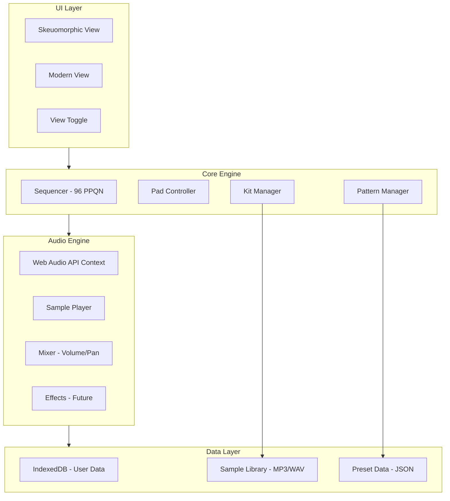

# Virtual DR-880 Browser Emulator

## Architecture Overview




## Tech Stack

- **Framework**: Astro 4.x with Svelte 5 components
- **Audio**: Web Audio API (sample playback, mixing)
- **Storage**: IndexedDB via `idb` library for user patterns/kits
- **Styling**: Tailwind CSS + custom CSS for skeuomorphic elements
- **Build/Deploy**: GitHub Actions to GitHub Pages

## Project Structure

```
virtual-dr880/
├── src/
│   ├── components/
│   │   ├── ui/                    # Shared UI components
│   │   │   ├── Knob.svelte
│   │   │   ├── Button.svelte
│   │   │   ├── Pad.svelte
│   │   │   └── Display.svelte
│   │   ├── skeuomorphic/          # Hardware replica view
│   │   │   ├── DR880Panel.svelte
│   │   │   ├── KeyPadGrid.svelte
│   │   │   └── LCDScreen.svelte
│   │   └── modern/                # Clean modern view
│   │       ├── ModernLayout.svelte
│   │       ├── PatternGrid.svelte
│   │       └── MixerPanel.svelte
│   ├── lib/
│   │   ├── audio/
│   │   │   ├── AudioEngine.ts     # Web Audio context & routing
│   │   │   ├── SamplePlayer.ts    # Sample loading & playback
│   │   │   └── Mixer.ts           # Volume, pan, sends
│   │   ├── sequencer/
│   │   │   ├── Sequencer.ts       # Main clock @ 96 PPQN
│   │   │   ├── Pattern.ts         # Pattern data structure
│   │   │   └── Transport.ts       # Play/stop/tempo control
│   │   ├── data/
│   │   │   ├── Kit.ts             # Kit data model
│   │   │   ├── Storage.ts         # IndexedDB wrapper
│   │   │   └── presets.ts         # Preset patterns/kits JSON
│   │   └── midi/                  # Future: Web MIDI API
│   │       └── MidiController.ts
│   ├── pages/
│   │   └── index.astro            # Main entry point
│   └── assets/
│       └── samples/               # Audio samples (MP3)
│           ├── kicks/
│           ├── snares/
│           ├── hihats/
│           ├── toms/
│           ├── cymbals/
│           ├── percussion/
│           └── bass/
├── public/
│   └── images/                    # UI textures, panel graphics
├── astro.config.mjs
├── package.json
├── tailwind.config.js
└── tsconfig.json
```

## Core Data Models

### Kit Structure (matching DR-880 spec)

```typescript
interface Kit {
  id: string;
  name: string;
  pads: PadAssignment[60];  // 3 banks x 20 pads
  bassTone: BassTone;
  drumLevel: number;        // 0-100
  bassLevel: number;        // 0-100
}

interface PadAssignment {
  instrumentId: string;
  level: number;            // 0-100
  pan: number;              // -50 to +50
  pitch: number;            // -50 to +50 semitones
  muteGroup: number | null; // 1-31 or null
}
```

### Pattern Structure (96 ticks per quarter note)

```typescript
interface Pattern {
  id: string;
  name: string;
  timeSignature: [number, number];  // e.g., [4, 4]
  measures: number;                  // 1-999
  tempo: number;                     // 20-260 BPM
  kitId: string;
  drumTrack: NoteEvent[];
  bassTrack: NoteEvent[];
}

interface NoteEvent {
  tick: number;           // 0 to (measures * beatsPerMeasure * 96)
  padIndex: number;       // 0-59 for drums, note number for bass
  velocity: number;       // 1-127
  duration?: number;      // For bass notes (in ticks)
}
```

## Implementation Phases

### Phase 1: Foundation (Core Audio + Basic UI)

- Set up Astro project with Svelte, Tailwind, TypeScript
- Implement `AudioEngine.ts` - Web Audio context initialization
- Implement `SamplePlayer.ts` - Load and trigger samples
- Create basic 20-pad grid that plays sounds on click/touch
- Add volume control (master, drum part, bass part)

### Phase 2: Sequencer Engine

- Implement high-resolution clock (96 PPQN) using `setInterval` + `AudioContext.currentTime`
- Create `Pattern.ts` data structure matching DR-880 format
- Build transport controls (play, stop, tempo, reset)
- Implement pattern playback with visual feedback

### Phase 3: Kit System

- Define 10-20 starter kits (subset of DR-880's 100 presets)
- Implement kit switching
- Add pad bank switching (DRUM 1/2/3, BASS)
- Per-pad parameters: level, pan, pitch, mute groups

### Phase 4: Pattern Editor

- Step sequencer grid view (matches DR-880 step recording)
- Real-time recording mode (record pad hits)
- Quantization options
- Pattern save/load to IndexedDB

### Phase 5: Dual UI Implementation

- **Skeuomorphic**: Canvas/SVG recreation of DR-880 front panel
  - Textured panel background
  - Realistic knobs with drag interaction
  - LCD-style display with custom font
  - Authentic button styling
- **Modern**: Clean grid-based interface
  - Responsive layout
  - Touch-optimized pads
  - Waveform/pattern visualization

### Phase 6: Sample Library

- Curate ~60-80 core samples covering main categories:
  - Kicks (8-10 variations)
  - Snares (8-10 variations) 
  - Hi-hats (6-8: closed, open, pedal)
  - Toms (4-6: high to low)
  - Cymbals (4-6: crash, ride, splash)
  - Percussion (10-15: congas, claps, shakers, etc.)
  - Bass tones (6-10: finger, slap, synth)
- Use ElevenLabs `text_to_sound_effects` to generate custom samples
- Optimize: MP3 at 44.1kHz for web delivery

## GitHub Pages Deployment

```yaml
# .github/workflows/deploy.yml
name: Deploy to GitHub Pages
on:
  push:
    branches: [main]
jobs:
  build:
    runs-on: ubuntu-latest
    steps:
      - uses: actions/checkout@v4
      - uses: actions/setup-node@v4
        with:
          node-version: 20
      - run: npm ci
      - run: npm run build
      - uses: actions/upload-pages-artifact@v3
        with:
          path: dist/
  deploy:
    needs: build
    runs-on: ubuntu-latest
    permissions:
      pages: write
      id-token: write
    environment:
      name: github-pages
    steps:
      - uses: actions/deploy-pages@v4
```

## Key Technical Considerations

- **Audio Latency**: Use `AudioContext.currentTime` for precise scheduling, not `setTimeout`
- **Mobile Support**: Handle touch events, AudioContext resume on user gesture
- **Sample Loading**: Lazy-load samples per kit to reduce initial load time
- **State Management**: Svelte stores for reactive UI updates
- **Offline Support**: Service worker for PWA capability (future enhancement)

## Sample Generation Strategy (ElevenLabs)

Generate core samples using descriptive prompts:

- `"Short punchy electronic kick drum hit, 808 style"`
- `"Crisp acoustic snare drum hit with snare wires"`
- `"Tight closed hi-hat cymbal hit"`
- `"Deep floor tom drum hit with natural decay"`
- `"Funky slap bass note, single hit, E note"`

Duration: 0.5-2 seconds depending on instrument type.